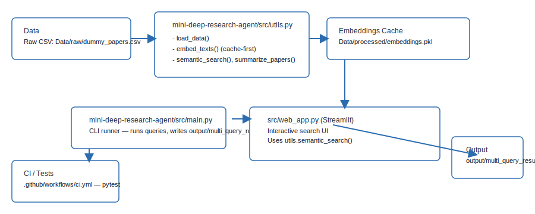

# Deep Research Agent

A modular Python project for loading research paper datasets, generating embeddings, performing semantic search, and summarizing top results.


Quick start

- Install dependencies (PowerShell):

```
pip install -r requirements.txt
```

- Run demo (from repository root):

```
python mini-deep-research-agent/src/main.py
```

Run tests (CI uses GitHub Actions):

```
pytest -q
```

Notes

- Embeddings are cached at `Data/processed/embeddings.pkl`. Remove that file to force re-embedding.
- See `.github/copilot-instructions.md` and `AGENT.md` for contributor and AI agent guidance.

Demo screenshot


Replace with real screenshot/GIF

If you'd like to replace the placeholder demo image with a real screenshot or GIF, capture your demo as `docs/demo_screenshot.png` or `docs/demo_screenshot.gif` and commit it. For detailed instructions see `docs/screenshot_instructions.md`.

Architecture



Web UI (optional)

You can run a small Streamlit app included at `src/web_app.py`:

```
streamlit run src/web_app.py
```

Sample console output (from `mini-deep-research-agent/src/main.py`):

```
=== 🚀 Deep Research Agent — Multi‑Query Mode ===

================================================================================
 🔍 Processing Query: machine learning
================================================================================

--------------------------------------------------------------------------------
Title: Deep Learning Basics
Abstract Preview: An introduction to deep learning concepts....
Authors: Alice Smith; Bob Jones
--------------------------------------------------------------------------------

📁 Results saved to: output/multi_query_results.json
```

